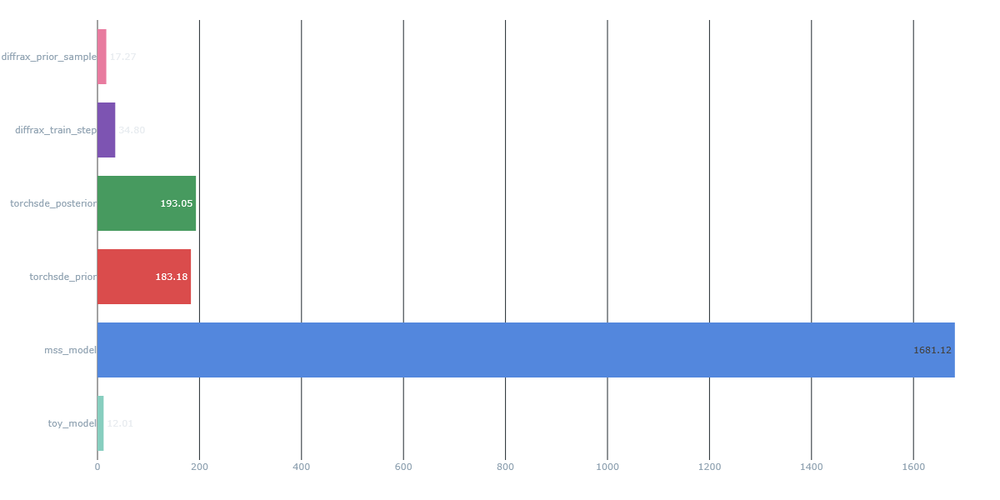

# NeuralSDE performance

## Initial JAX/Diffrax test
Baseline training:
- Batch of 25
- 11 batches took 26:17. 
- Time per batch: 2.389 minutes or 143.34 seconds

Intial test training:
- Batch of 32
- 11090 steps in 184827 seconds: 51 hours, 20 minutes, and 27 seconds
- Time per step: 16.666 seconds

Same timestep size, same sample length
Comparing metrics:
- Time per step: 8.6x speedup
- Samples per second: 0.174 vs 1.92 samples/s. 11.03x speedup

Inference:
All for 10800 @ 20Hz

- Toy model: 12.01s (single run)
- Diffrax: 17.27 (batch of 50)
- TorchSDE: 183s (batch of 50)
- MSS: 1681.12s (single run)
  
# Initial tuning of model with faster version
- Simplifying noise - 3 channels of noise, independent of time or state
  - Additive noise
  - Time invarient
  - 3DOF for noise
  
- Time independent dynamics model (time-invariant system)
  - f/h does not take t in the input